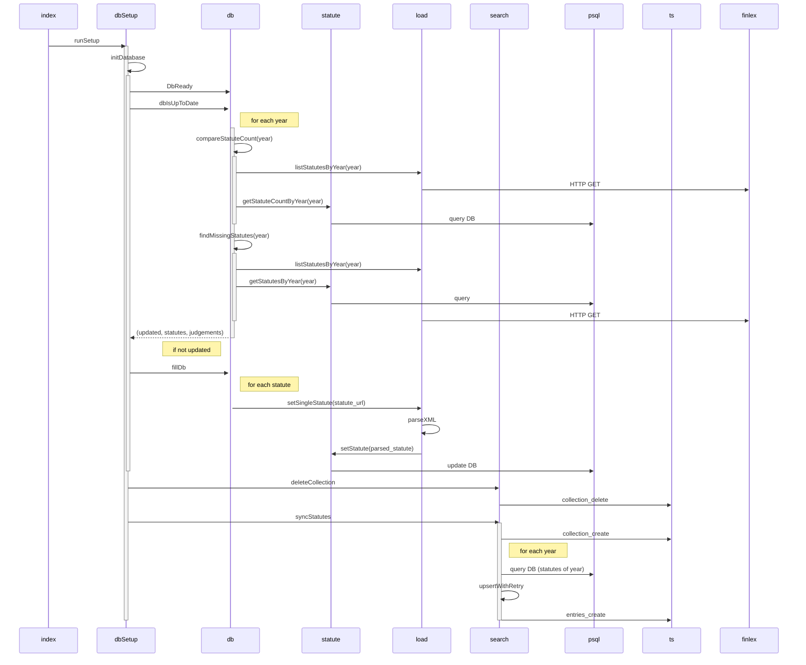

# SEB-yhteensopiva_finlex-lukija

Projektin dokumentaatio löytyy [Wikistä](https://github.com/ohjelmistotuotantoprojekti/SEB-yhteensopiva_finlex-lukija/wiki)


## Local dev

```
docker compose up
npm --prefix ./backend run dev
npm --prefix ./front run dev
```

## Tietokannan päivitys/synkronointi


