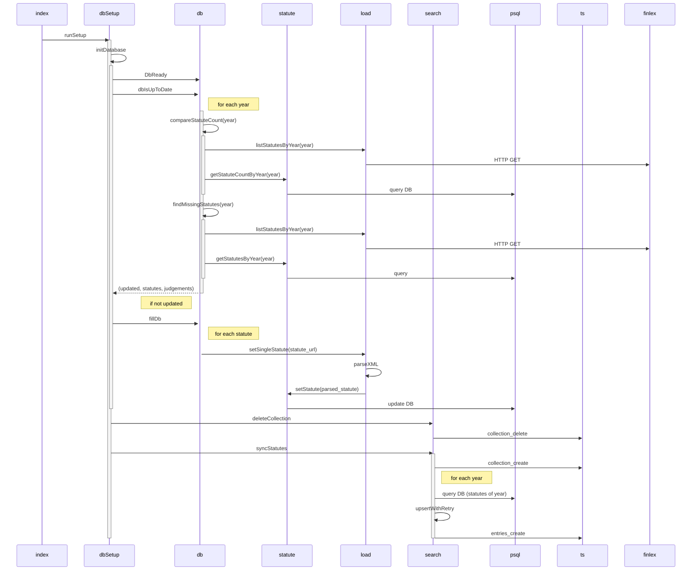

# SEB-yhteensopiva_finlex-lukija

Projektin dokumentaatio löytyy [Wikistä](https://github.com/ohjelmistotuotantoprojekti/SEB-yhteensopiva_finlex-lukija/wiki) (Osittain vanhentunut)


## Local dev

```
docker compose up
```

## To Do
P1
- Sentryn frontend-virheiden capturaaminen
- Kirjautuminen Admin-näkymään

P2
- Status-taulukon käyttäytyminen vähän jank
  - estää myös pääsyn admin-näkymään välillä mikä ei tarkoituksenmukaista
  - välillä näyttää väärää viestiä kun klikkailee päivitystä
- Parempi päivityslogiikka?
  - Jättää nyt joitain välistä, en tiedä onko 429ien takia, pitäisi parantaa lokitusta/backoffia/retryjä
  - Ylimääräisten poisto
- Oikeuskäytännön parsiminen fi/sv tällä hetkellä vaikuttaisi toimivan, mutta on vähän epätäsmällinen
  - käyttää "kielen tunnistamista", joidenkin avainsanojen perusteella
  - HTML/Flight/React dokumenttien parsiminen täsmällisemmin Finlexin puolelta jokseenkin monimutkaista

P3
- Asiasanojen korjaaminen

## Tietokannan päivitys/synkronointi


