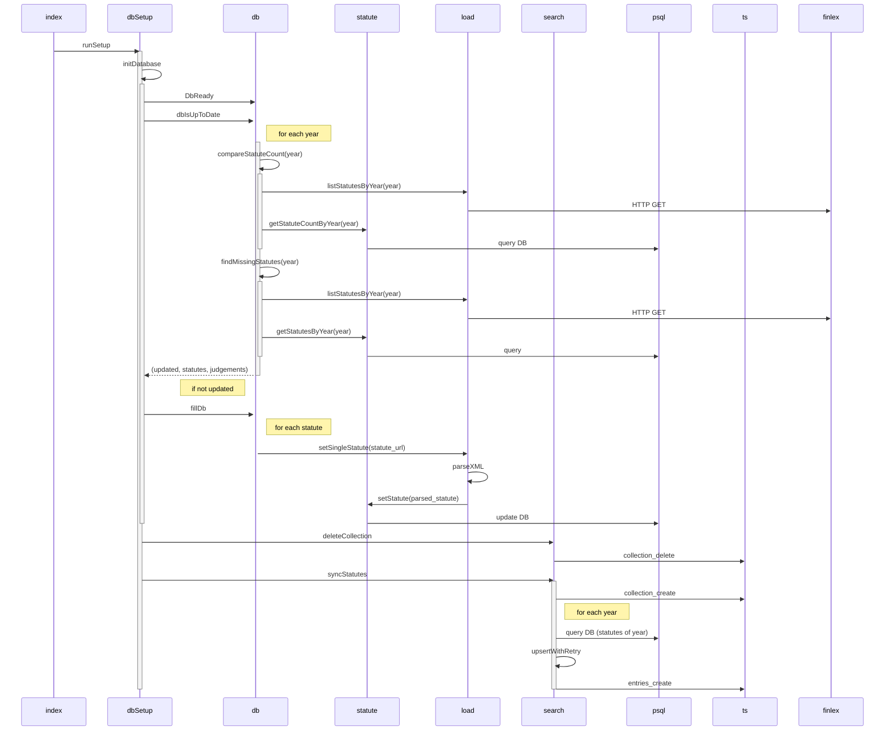

# SEB-yhteensopiva_finlex-lukija

Projektin dokumentaatio löytyy [Wikistä](https://github.com/ohjelmistotuotantoprojekti/SEB-yhteensopiva_finlex-lukija/wiki) (Osittain vanhentunut)


## Local dev

```
docker compose up
```

## To Do
- Kontitus [DONE]
- Cypress tms. kuormitustestaus
    - Cypress tai joku podi Openshiftiin
    - Lueskelin Cypressistä
    - Pitää tutkia myös podi-vaihtoehtoa
    - Luultavasti apua Matiakselta tarpeen
- Judgmentit ei toimi?
    - Ei vielä mitään hajua miksi, ehkä joku typesense-rajapintaongelma
    - Ongelma lokaali ja tuotantoympäristössä
    - Kuinka paljon oikeuskäytäntöä tarvitaan? Tarvitaanko esim. jo Tammikuun tenteissä?
- Finlexin rate limiting tms.
    - ~180 kyselyä minuutissa / IP-osoite (Kysyin Finlex-deviltä)
    - Ei todnäk ongelma päätietokantaa päivitellessä inkrementaalisesti
    - Tarve kuitenkin saada toimimaan, että saa tarvittaessa tyhjästä uuden tietokannan pystyyn

## Tietokannan päivitys/synkronointi


