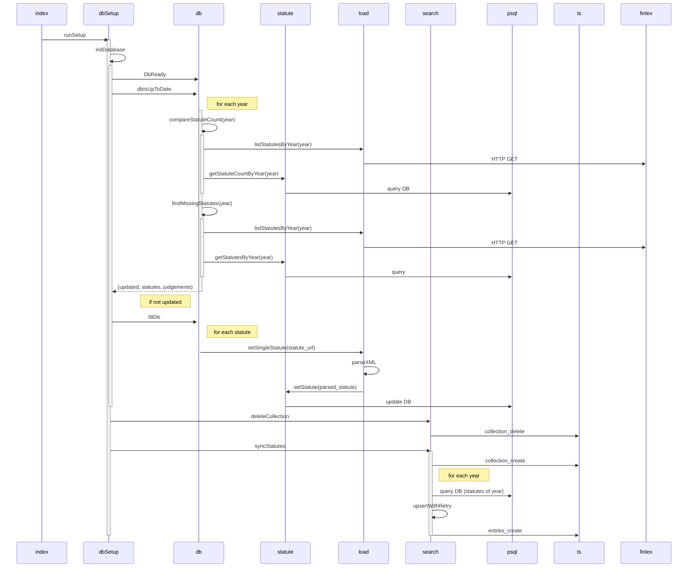

# SEB-yhteensopiva_finlex-lukija

Projektin dokumentaatio löytyy [Wikistä](https://github.com/ohjelmistotuotantoprojekti/SEB-yhteensopiva_finlex-lukija/wiki) (Osittain vanhentunut)


## Local dev

```
docker compose up
```

## To Do

20.5. Muistiinpanoja ajantasaisuus/kumottu fikseistä
- Ajantasaisuus/kumottu-leima lienee triviaali, löytyy xml:stä true/false-lippu tyyliin:
```
<proprietary source="#organization_fi.finlex">
<finlex:documentYear>2014</finlex:documentYear>
<finlex:administrativeBranch refersTo="#fi.ministry-of-the-environment"/>
<finlex:typeStatute refersTo="#act"/>
<finlex:isInForce value="true"/>
```
- pitää ehkä kumota tietokannan täytöstä kohta joka jättää kumotut pois?
- 603/1977 mystisempi, tenttilexin versio ajantasainen, mutta vanha ajantasainen?


## Tietokannan päivitys/synkronointi


```mermaid
sequenceDiagram
  participant index
  participant dbSetup
  participant db
  participant statute
  participant load
  participant search
  participant psql
  participant ts
  participant finlex

  index ->> dbSetup: runSetup
  activate dbSetup
  dbSetup ->> dbSetup: initDatabase
    activate dbSetup
    dbSetup ->> db: DbReady
    dbSetup ->>+ db: dbIsUpToDate
    Note right of db: for each year
      activate db
      db ->> db: compareStatuteCount(year)
        activate db
        db ->> load: listStatutesByYear(year)
        load ->> finlex: HTTP GET
        db ->> statute: getStatuteCountByYear(year)
        statute ->> psql: query DB
        deactivate db
      db ->> db: findMissingStatutes(year)
        activate db
        db ->> load : listStatutesByYear(year)
        load ->> finlex: HTTP GET
        db ->> statute: getStatutesByYear(year)
        statute ->> psql: query
        deactivate db
      db -->> dbSetup: (updated, statutes, judgements)
      deactivate db
    Note left of db: if not updated
    dbSetup ->> db: fillDb
    Note right of db: for each statute
    db ->> load: setSingleStatute(statute_url)
    load ->> load: parseXML
    load ->> statute: setStatute(parsed_statute)
    statute ->> psql: update DB
    deactivate dbSetup
  dbSetup ->> search: deleteCollection
  search ->> ts: collection_delete
  dbSetup ->> search: syncStatutes
    activate search
    search ->> ts: collection_create
    Note right of search: for each year
    search ->> psql: query DB (statutes of year)
    search ->> search: upsertWithRetry
    search ->> ts: entries_create
    deactivate search
  deactivate dbSetup
```
